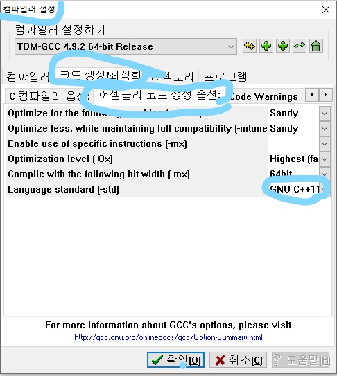
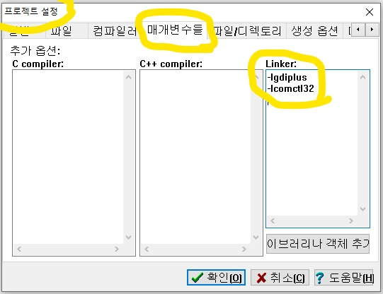

# Omok-GUI-with-Gdiplus  

To compile in DEV C ++, you must change the settings as shown below.

  
  

간단한 설명은 아래 블로그에 있습니다.  
https://blog.naver.com/dnpc7848/221525242099  
https://blog.naver.com/dnpc7848/221526575539  
https://blog.naver.com/dnpc7848/221528609925

